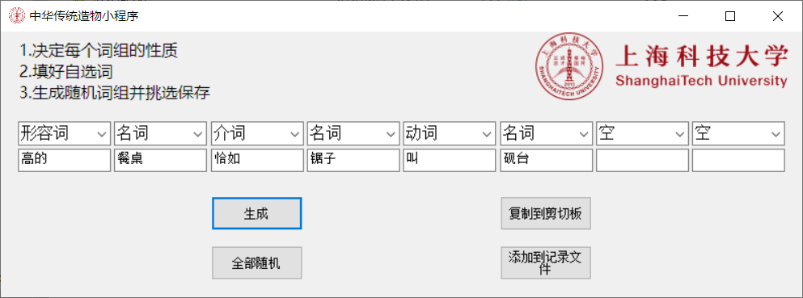
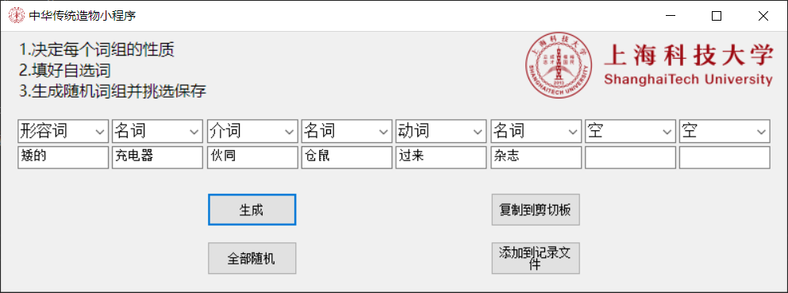
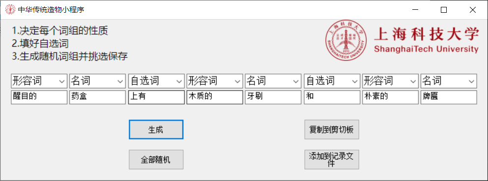

# RandomWords
## 中华传统文化@ShanghaiTech 小程序
Random inspiration of Chinese characters.

## 使用方法
* 向不同txt中增加各类所需词语文本，一行一个
* 打开软件，选好此行
* 填上自选词
* 生成
* 复制到剪切板或保存到 组合结果.txt 中备用
* 或者使用全部随机功能（大概率不会生成出有意义的组合）

## 例子

